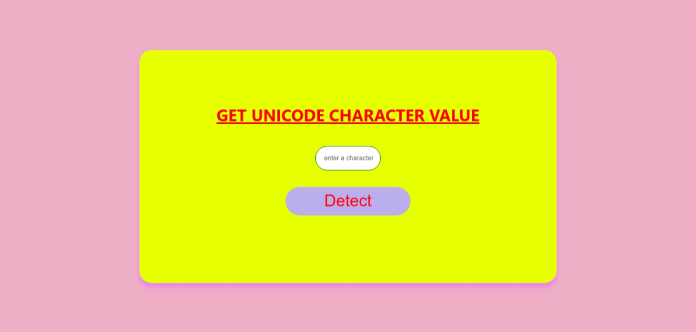
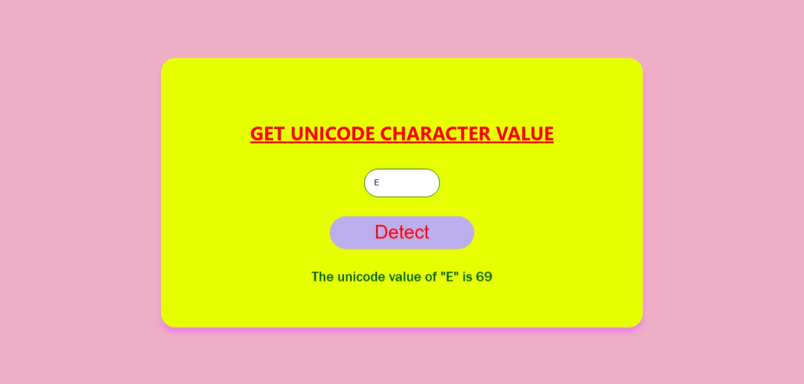

# 🗓️ Day-Based Quote Generator + 🔡 Unicode Value Detector

This mini web project displays:
1. A **funny or motivational quote** based on the current day.
2. A tool to detect the **Unicode value** of a typed character.

---

## 🔗 Live Demo

👉 [Click here to view the live project](https://unicode-converterr.netlify.app/)

---

## 🎯 Features

### 🗓️ Quote of the Day
- Detects current day of the week
- Displays custom quote related to that day
- Updates automatically on page load

### 🔡 Unicode Detector
- Enter any character
- Detects and shows Unicode value instantly

---

## 🖼️ Output Screenshots

### ✅ Day-Based Quote

### ✅ Unicode Value Detector

---

---

## 💻 Tech Used

- HTML5
- CSS3
- JavaScript

---

## 🔍 How It Works

### 🎯 Quote Generator
- Uses `new Date().getDay()` to detect the current day (0 for Sunday)
- An array of day objects stores quotes
- The quote is selected using the current day's index

### 🔍 Unicode Detector
- Takes input from a text box
- Uses `charCodeAt(0)` to detect Unicode value
- Displays result below the button

---

## 🙋‍♂️ Author

**Dhinesh Kumar**  
🔗 [GitHub Profile](https://github.com/msdhinesh45)

---

## 📜 License

Free to use for educational and personal projects. No attribution required.

---

